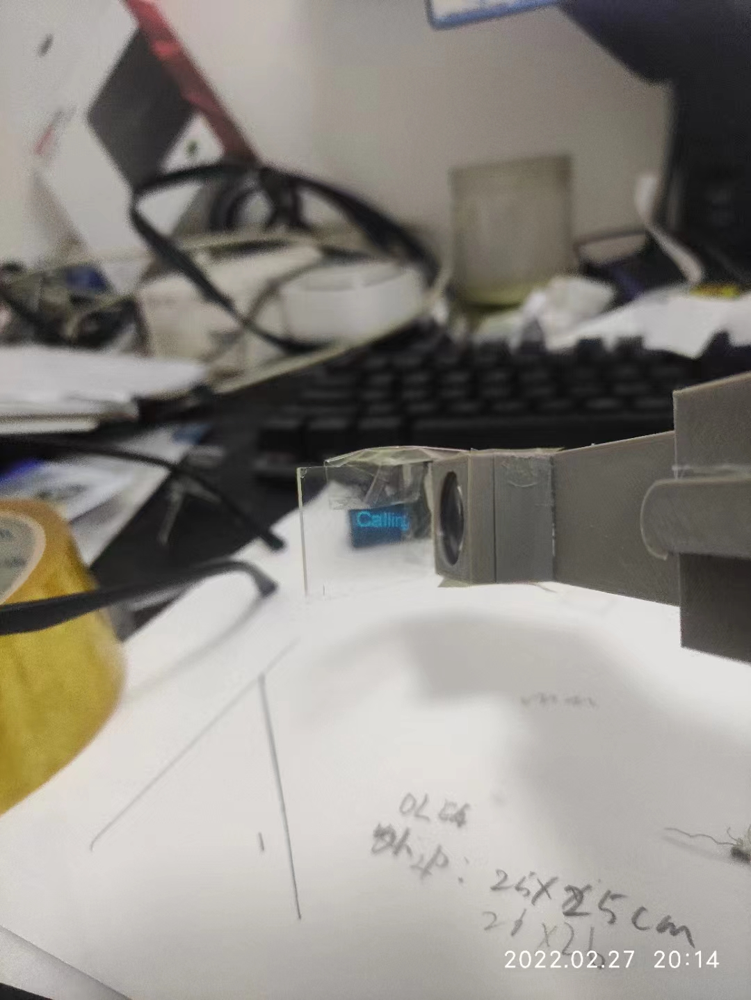
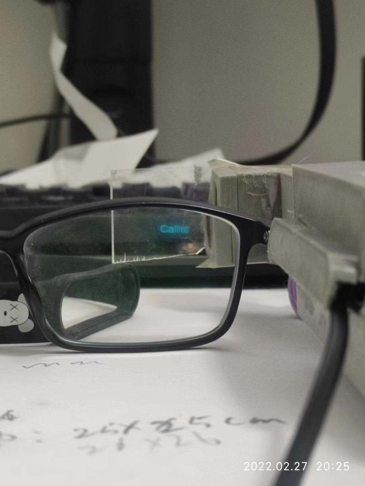
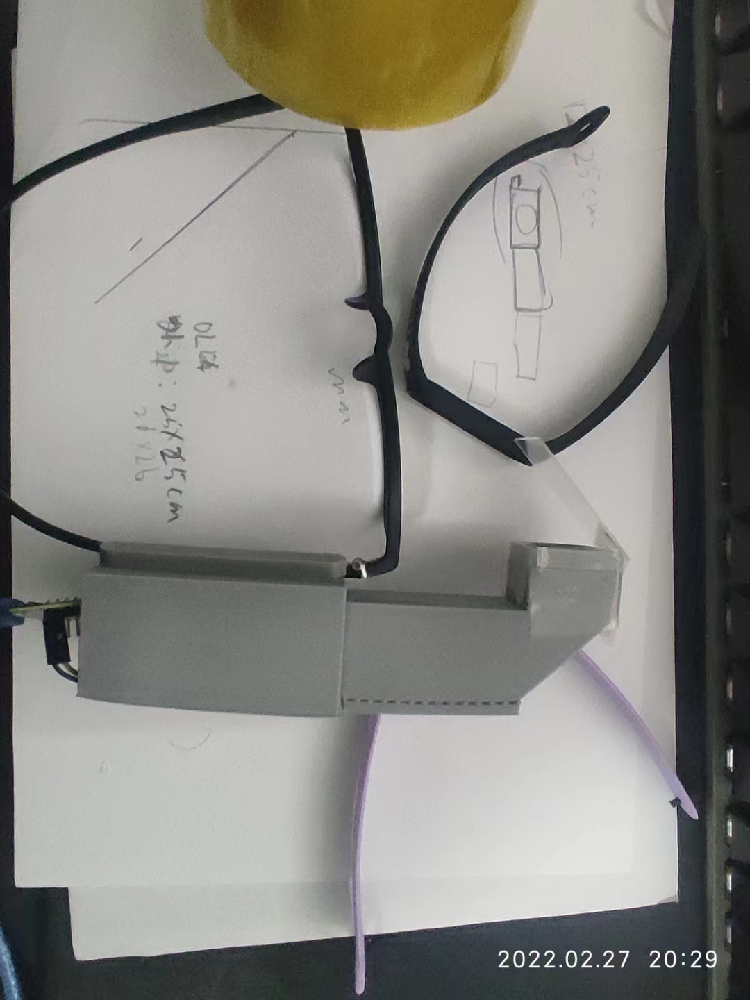

# KoburaGlasses
Kobura 是 コブラ 的罗马音即是 眼镜蛇 的意思。

## 最新进展
[点这里](./versions/alpha-202112/README.md)

## 来自
它是我21年研究的课题，不过现阶段看来顶多算是“复刻”大佬的作品。

## 目的
对，我打算长期深入该课题。  
1. 因为本人挺懒的，所以希望通过开源吸引些同样感兴趣的小伙伴，互相鼓励学习。
2. 将每年的课题都公开出来，看下会收获到什么。

## 贴上大神名字
这个 IDEA 最初是来自 Alain Mauer 大神，youtube很多关于这方面的视频都是抄袭这位大神的。

## 实验品

## 欢迎
非常欢迎同样热爱技术的小伙伴一起交流沟通。