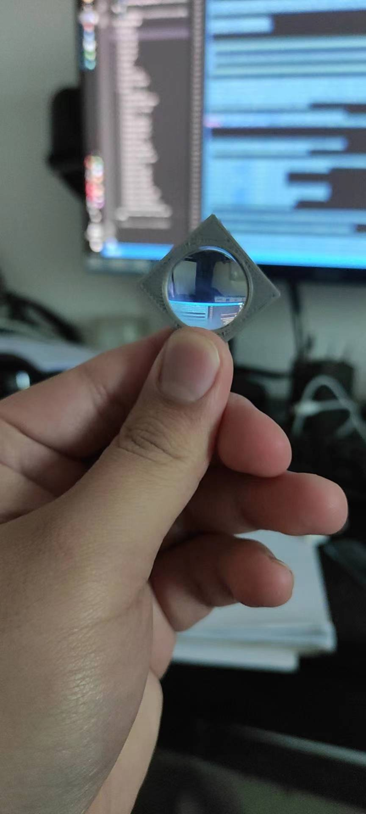

### 第一步 | 尝一下物理效果

   

芜湖，可行！    
光源 & 反光镜 & 平凸镜 这三个摆放都是有距离角度要求的，这需要算呀。  
镜子角度45°；镜子距离平凸镜50mm；镜子中心点距离光源100mm；亚克力板外侧距离平凸镜40mm(这块具体距离需要凭感觉)；亚克力板45°。

### 第二步 | 设计模型
   
   

### 第三步 | 打印
   
 
 ### 第三步 | 组装实验
   
   
    
    
